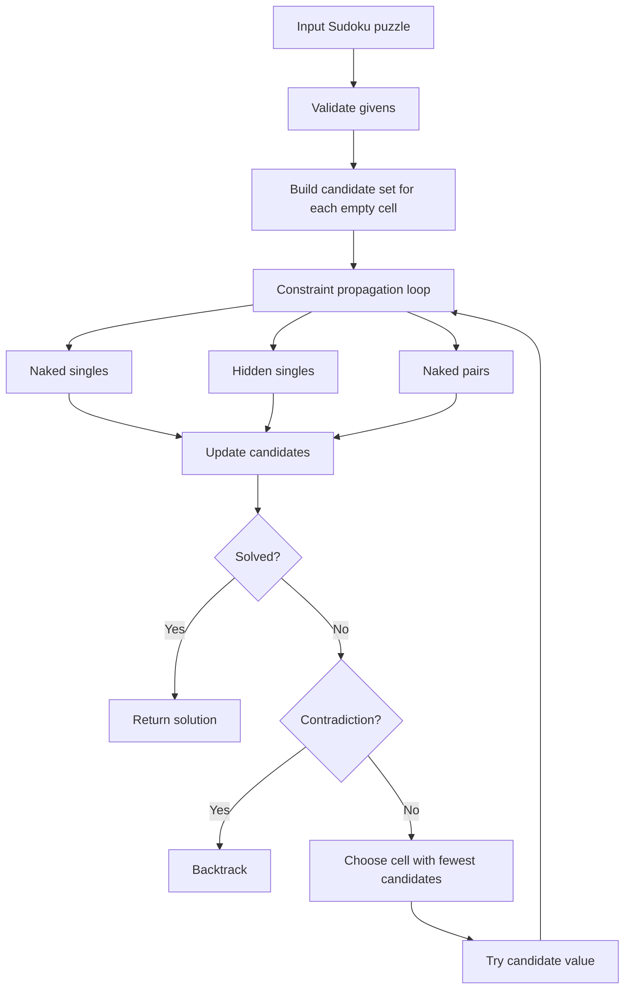

# Heuristics For Solving Sudoku: Literature, Method, And Benchmark

**Date:** 18 May 2026
**Repository:** [github.com/chandler20708/Sudoku](https://github.com/chandler20708/Sudoku)
**Main purpose:** demonstrate practical use of heuristics by building and testing a Sudoku-solving system.

## 1. Executive Summary

This project uses Sudoku as a small but meaningful constraint problem. The goal is not to claim that Sudoku is the hardest optimisation problem, but to show a clear understanding of how heuristics reduce search.

The proposed solution combines:

- candidate elimination;
- naked singles;
- hidden singles;
- naked pairs;
- minimum remaining values branching;
- depth-first search fallback.

On the generated benchmark set of 20 unique Sudoku puzzles, the proposed heuristic solved **20/20**. Plain recursive backtracking solved **17/20** under a 200,000-decision cap. Gurobi default and Gurobi with heuristic-focused parameters both solved **20/20**, but their Python/MIP modelling overhead was larger than the custom heuristic on this small puzzle size.

The main result is straightforward: **heuristics help because they use problem structure before searching blindly**.

## 2. Research Question

Can a transparent heuristic Sudoku solver demonstrate stronger practical optimisation understanding than a pure programming baseline, and how does it compare with a general-purpose MIP solver such as Gurobi?

This project is positioned as an applied optimisation and algorithmic reasoning exercise. It focuses on clear explanation of decision rules, constraints, search effort, and evaluation metrics rather than on advanced mathematical proof.

## 3. Small Literature Review

Peter Norvig's classic Sudoku solver frames the problem as constraint propagation plus search: reduce possible values first, then search only when needed ([Norvig](https://norvig.com/sudoku.html)). This is the strongest direct inspiration for the proposed solver.

A recent comparative paper reports that heuristic constraint propagation can outperform recursive backtracking across difficulty levels, with larger speedups on harder puzzles ([arXiv 2507.09708](https://arxiv.org/abs/2507.09708)). This supports the project direction, although the present benchmark is smaller and should be treated as a compact empirical demonstration.

McGuire, Tugemann and Civario's proof that no 16-clue Sudoku exists shows that Sudoku belongs to a serious combinatorial search family, not just a toy puzzle ([arXiv 1201.0749](https://arxiv.org/abs/1201.0749)). Their work is about puzzle existence rather than day-to-day solving, but it is useful evidence that naive search can become inadequate at scale.

Stochastic optimisation approaches, including genetic algorithms, particle swarm methods, and simulated annealing, have also been applied to Sudoku ([arXiv 0805.0697](https://arxiv.org/abs/0805.0697)). These are useful alternatives, but they are less transparent for this project. Since the goal is to prove understanding, a clear constraint heuristic is better than a black-box metaheuristic.

For the solver baseline, the current Gurobi documentation checked on 18 May 2026 is for **Gurobi Optimizer 13.0** ([Gurobi docs](https://docs.gurobi.com/current/)). Gurobi's help center describes parameter tuning across MIP components, including primal heuristics and the NoRel heuristic ([Gurobi parameter tuning](https://support.gurobi.com/hc/en-us/articles/19998635021713-What-is-parameter-tuning)). It also distinguishes MIP starts from variable hints as ways to provide heuristic problem knowledge to a MIP solver ([Gurobi MIP starts and hints](https://support.gurobi.com/hc/en-us/articles/20410834783377-What-are-the-differences-between-MIP-Starts-and-Variable-Hints)).

## 4. Gap And Project Positioning

The gap is not that Sudoku has no solvers. It has many. The gap for this project is educational and methodological:

- many simple Sudoku projects show code but do not explain heuristics clearly;
- many optimisation solver examples show formulation but not why a custom heuristic may be more efficient;
- many algorithm comparisons focus only on time, not search effort, completion rate, and interpretability.

This project fills that gap by building one transparent heuristic architecture and comparing it against:

- a pure programming baseline;
- Gurobi as a general MIP solver;
- Gurobi with heuristic-oriented settings.

## 5. Proposed Heuristic Architecture



The important idea is the loop. The solver does not guess immediately. It first uses Sudoku constraints to reduce uncertainty.

## 6. Baselines


| Solver             | What it represents                                            | Why included                                                                 |
| ------------------ | ------------------------------------------------------------- | ---------------------------------------------------------------------------- |
| Plain backtracking | Typical programming solution                                 | Shows what happens when search is mostly blind.                              |
| Proposed heuristic | Constraint propagation plus MRV branching                     | Main method being tested.                                                    |
| Gurobi default     | General-purpose binary MIP solver                             | Shows the optimisation-modelling baseline.                                   |
| Gurobi heuristics  | Gurobi with`Heuristics=1.0`, `MIPFocus=1`, `NoRelHeurWork=20` | Tests whether Gurobi's heuristic-oriented settings help on this formulation. |

## 7. Metrics


| Metric                       | What it measures                                                   | Why it matters                                                   |
| ---------------------------- | ------------------------------------------------------------------ | ---------------------------------------------------------------- |
| Completion count             | Number of puzzles solved within the solver budget                  | The first requirement is correctness and completion.             |
| Solve time                   | Wall-clock milliseconds in this Python run                         | Measures practical user-facing speed.                            |
| Decisions                    | Branch choices for custom solvers; Gurobi node count proxy for MIP | Measures search effort, not just time.                           |
| Backtracks                   | Number of times a branch had to be undone                          | Shows how often the solver made an unproductive choice.          |
| Assignments and eliminations | Propagation work done by the heuristic solver                      | Shows whether progress came from reasoning rather than guessing. |
| Maximum depth                | Deepest search recursion level                                     | Gives a simple complexity proxy.                                 |

These metrics are useful together because time alone can mislead. Gurobi has model-building overhead; plain backtracking may be fast on easy puzzles but explode on hard ones; the heuristic solver may spend more time reasoning but save search branches.

## 8. Benchmark Setup

The benchmark generated **20 unique puzzles**:

- 5 easy;
- 5 medium;
- 5 hard;
- 5 expert.

Difficulty was generated using target clue counts:

- easy: about 40 clues;
- medium: about 34 clues;
- hard: about 28 clues;
- expert: about 24 clues.

Each generated puzzle was checked for uniqueness. The plain backtracking baseline was capped at **200,000 decisions** so that a few hard puzzles could not dominate the whole benchmark.

Raw outputs:

- `data/processed/generated_puzzles.csv`
- `outputs/tables/benchmark_results.csv`

## 9. Results


| Difficulty |             Solver | Solved / 5 | Median time (ms) | Median decisions |
| ---------- | -----------------: | ---------: | ---------------: | ---------------: |
| Easy       | Proposed heuristic |      5 / 5 |             0.86 |                0 |
| Easy       | Plain backtracking |      5 / 5 |             0.53 |              516 |
| Easy       |     Gurobi default |      5 / 5 |             4.95 |                0 |
| Easy       |  Gurobi heuristics |      5 / 5 |             4.98 |                0 |
| Medium     | Proposed heuristic |      5 / 5 |             0.99 |                0 |
| Medium     | Plain backtracking |      5 / 5 |             5.23 |            5,673 |
| Medium     |     Gurobi default |      5 / 5 |             4.72 |                0 |
| Medium     |  Gurobi heuristics |      5 / 5 |             4.57 |                0 |
| Hard       | Proposed heuristic |      5 / 5 |             1.22 |                0 |
| Hard       | Plain backtracking |      2 / 5 |           171.16 |          200,001 |
| Hard       |     Gurobi default |      5 / 5 |             4.98 |                0 |
| Hard       |  Gurobi heuristics |      5 / 5 |             4.80 |                0 |
| Expert     | Proposed heuristic |      5 / 5 |             1.54 |                4 |
| Expert     | Plain backtracking |      4 / 5 |           146.22 |          154,435 |
| Expert     |     Gurobi default |      5 / 5 |             4.95 |                0 |
| Expert     |  Gurobi heuristics |      5 / 5 |             5.03 |                0 |


## 10. Visual Puzzle Examples

The easy example is mostly solved by propagation. The heuristic has enough information to keep filling forced values.


The expert example has fewer clues and needs branching. This is where MRV matters: the solver chooses a cell with the fewest candidates instead of guessing from the first empty square.


## 11. Interpretation

The proposed heuristic performs best in this benchmark because it uses the structure of Sudoku. Instead of trying values in the first empty cell, it asks: which cells are already forced, which candidates can be removed, and where is the smallest remaining uncertainty?

Plain backtracking is simple but weak. It solves easy and medium puzzles, but hard puzzles can push it into many unproductive branches. In this run, it hit the decision budget on several hard cases.

Gurobi is reliable. It solves the binary MIP formulation cleanly. However, Sudoku is tiny, and converting it into a MIP model has overhead. For a single 9 by 9 puzzle, a custom heuristic can be faster and easier to explain.

The Gurobi heuristic settings did not transform the result. That is not surprising: Sudoku's MIP formulation is already highly constrained, and the instance size is small. Gurobi's heuristic features are more meaningful on larger, harder MIP models where finding an early feasible solution is difficult.

## 12. Computational Complexity Assessment

In worst-case theory, Sudoku solving is combinatorial. A naive solver may branch over many empty cells and many values, so the search space can grow exponentially.

The proposed heuristic does not remove worst-case exponential complexity. What it does is reduce the practical search tree:

- candidate elimination reduces possible values;
- naked and hidden singles force assignments without branching;
- naked pairs remove values from neighbouring cells;
- MRV chooses the smallest branch when guessing is unavoidable.

So the honest claim is:

> The heuristic does not change Sudoku into a polynomial-time problem, but it greatly reduces practical search effort on the benchmark set.

## 13. Limitations And Constraints

This is a compact project, not a publishable large-scale algorithm paper.

Main limitations:

- the benchmark has only 20 generated puzzles;
- difficulty is based mainly on clue count, which is imperfect;
- generated puzzles may not represent newspaper, competition, or adversarial Sudoku distributions;
- Gurobi results include Python model-building overhead, so they should not be interpreted as pure solver-engine time;
- the Gurobi heuristic comparison uses parameter settings, not a deeply tuned MIP start or variable hint strategy;
- the proposed solver includes only a small subset of human Sudoku techniques.

These limitations are acceptable for the stated purpose: demonstrating how heuristics work and how they can be evaluated honestly.

## 14. Recommended Next Step

If this project were extended, the next best improvement would be to test against a larger public puzzle corpus and add stronger human-style strategies such as pointing pairs, box-line reduction, X-wing, and chains. For an optimisation angle, the next best Gurobi extension would be to use the heuristic solver to provide a MIP start or variable hints, then measure whether that improves Gurobi on larger Sudoku variants.

## 15. Source And Reproducibility Notes

Run the benchmark:

```bash
PYTHONPATH=src LC_ALL=C LANG=C ./.venv/bin/python scripts/run_benchmark.py
```

Run validation:

```bash
uv run pytest
uv run ruff check src tests
```

Key source files:

- `src/sudoku_heuristics/generator.py`
- `src/sudoku_heuristics/solvers.py`
- `src/sudoku_heuristics/benchmark.py`
- `src/sudoku_heuristics/visuals.py`
