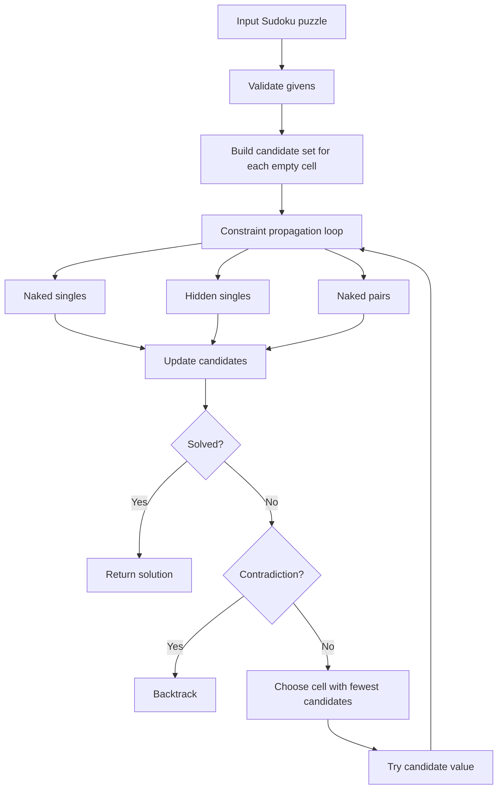

# Heuristics For Solving Sudoku: Literature, Method, And Benchmark

**Date:** 18 May 2026  
**Repository:** [github.com/chandler20708/Sudoku](https://github.com/chandler20708/Sudoku)  
**Main purpose:** demonstrate practical use of heuristics by building and testing a Sudoku-solving system.

## 1. Executive Summary

This project uses Sudoku as a compact constraint satisfaction problem. The point is not that Sudoku is the hardest optimisation problem; the point is that Sudoku makes search, constraints, and heuristic design easy to inspect.

The proposed solver combines candidate elimination, naked singles, hidden singles, naked pairs, minimum remaining values branching, and depth-first fallback search.

On the generated benchmark set of **40 unique Sudoku puzzles**, the proposed heuristic solved **40/40**. Plain recursive backtracking solved **36/40** under a 200,000-decision cap. Gurobi default and Gurobi with heuristic-focused parameters both solved **40/40**. The edge-case suite also includes an invalid puzzle, an ambiguous puzzle, and a very hard puzzle that plain recursive backtracking could not solve under a smaller decision budget.

The main result is straightforward: **heuristics help because they use problem structure before searching blindly**.

## 2. Research Question

Can a transparent heuristic Sudoku solver reduce search effort compared with plain recursive backtracking, and how does it compare with a general-purpose MIP solver such as Gurobi?

This project is positioned as an applied optimisation and algorithmic reasoning exercise. It focuses on clear explanation of decision rules, constraints, search effort, and evaluation metrics rather than on advanced mathematical proof.

## 3. Small Literature Review

Peter Norvig's classic Sudoku solver frames the problem as constraint propagation plus search: reduce possible values first, then search only when needed ([Norvig](https://norvig.com/sudoku.html)). This is the strongest direct inspiration for the proposed solver.

A recent comparative paper reports that heuristic constraint propagation can outperform recursive backtracking across difficulty levels, with larger speedups on harder puzzles ([arXiv 2507.09708](https://arxiv.org/abs/2507.09708)). This supports the project direction, although the present benchmark is smaller and should be treated as a compact empirical demonstration.

McGuire, Tugemann and Civario's proof that no 16-clue Sudoku exists shows that Sudoku belongs to a serious combinatorial search family, not just a toy puzzle ([arXiv 1201.0749](https://arxiv.org/abs/1201.0749)).

Stochastic optimisation approaches, including genetic algorithms, particle swarm methods, and simulated annealing, have also been applied to Sudoku ([arXiv 0805.0697](https://arxiv.org/abs/0805.0697)). These are useful alternatives, but they are less transparent for this compact project. Since the goal is explainable heuristic reasoning, a clear constraint heuristic is more suitable than a black-box metaheuristic.

For the solver baseline, the current Gurobi documentation checked on 18 May 2026 is for **Gurobi Optimizer 13.0** ([Gurobi docs](https://docs.gurobi.com/current/)). Gurobi's help center describes parameter tuning across MIP components, including primal heuristics and the NoRel heuristic ([Gurobi parameter tuning](https://support.gurobi.com/hc/en-us/articles/19998635021713-What-is-parameter-tuning)). It also distinguishes MIP starts from variable hints as ways to provide heuristic problem knowledge to a MIP solver ([Gurobi MIP starts and hints](https://support.gurobi.com/hc/en-us/articles/20410834783377-What-are-the-differences-between-MIP-Starts-and-Variable-Hints)).

## 4. Gap And Project Positioning

The gap is not that Sudoku has no solvers. The gap for this project is explanatory and methodological:

- many simple Sudoku projects show code but do not explain heuristics clearly;
- many optimisation solver examples show formulation but not why a custom heuristic may be more efficient;
- many algorithm comparisons focus only on time, not search effort, completion rate, invalid cases, ambiguity, and interpretability.

This project fills that gap by building one transparent heuristic architecture and comparing it against plain recursive backtracking, Gurobi default, and Gurobi with heuristic-oriented settings.

## 5. Proposed Heuristic Architecture



The important idea is the loop. The solver does not guess immediately. It first uses Sudoku constraints to reduce uncertainty.

## 6. Difficulty Definition

The project no longer treats clue count as the whole definition of difficulty. Fewer clues often make a puzzle harder, but not always. Some puzzles with fewer clues are easy because the remaining givens create many forced moves. Some puzzles with more clues are harder because the search branches are less obvious.

The generated benchmark therefore uses two stages:

1. Generate a varied pool of unique puzzles using different clue targets.
2. Relabel the final benchmark set by a measured difficulty score.

The measured difficulty score combines:

- number of empty cells;
- average candidate-set size across empty cells;
- largest candidate-set size;
- decisions, backtracks, and search depth required by the proposed heuristic;
- a small propagation-effort term from candidate eliminations.

This is still only a practical proxy, but it is more defensible than clue count alone.

## 7. Baselines

| Solver | What it represents | Why included |
|---|---|---|
| Plain recursive backtracking | Basic programming search | Shows what happens when search is mostly blind. |
| Proposed heuristic | Constraint propagation plus MRV branching | Main method being tested. |
| Gurobi default | General-purpose binary MIP solver | Shows the optimisation-modelling baseline. |
| Gurobi heuristics | Gurobi with `Heuristics=1.0`, `MIPFocus=1`, `NoRelHeurWork=20` | Tests whether heuristic-oriented Gurobi settings help on this formulation. |

## 8. Metrics

| Metric | What it measures | Why it matters |
|---|---|---|
| Completion count | Number of puzzles solved within the solver budget | Correctness and completion come first. |
| Solve time | Wall-clock milliseconds in this Python run | Measures practical user-facing speed. |
| Decisions | Branch choices for custom solvers; Gurobi node count proxy for MIP | Measures search effort, not just time. |
| Backtracks | Number of times a branch had to be undone | Shows how often the solver made an unproductive choice. |
| Assignments and eliminations | Propagation work done by the heuristic solver | Shows whether progress came from reasoning rather than guessing. |
| Maximum depth | Deepest search recursion level | Gives a simple complexity proxy. |
| Solution count capped at 2 | Whether a puzzle has zero, one, or multiple completions | Separates valid Sudoku puzzles from invalid or ambiguous cases. |

## 9. Benchmark Setup

The main benchmark generated **40 unique puzzles**: 10 easy, 10 medium, 10 hard, and 10 expert.

Each generated puzzle was checked for uniqueness before inclusion. Difficulty labels were assigned by measured difficulty-score quartiles, not simply by the number of clues. The plain recursive baseline was capped at **200,000 decisions** in the main benchmark.

The edge-case benchmark includes a contradictory puzzle with duplicate fixed values, an empty-grid ambiguous puzzle with many completions, the very hard AI Escargot puzzle, and a sparse stress puzzle.

Raw outputs:

- `data/processed/generated_puzzles.csv`
- `outputs/tables/benchmark_results.csv`
- `outputs/tables/edge_case_results.csv`

## 10. Main Results

| Difficulty | Solver | Solved / 10 | Median difficulty score | Median time (ms) | Median decisions |
|---|---:|---:|---:|---:|---:|
| Easy | Proposed heuristic | 10 / 10 | 79.37 | 0.81 | 0 |
| Easy | Plain recursive | 10 / 10 | 79.37 | 1.06 | 1,160 |
| Easy | Gurobi default | 10 / 10 | 79.37 | 4.86 | 0 |
| Easy | Gurobi heuristics | 10 / 10 | 79.37 | 4.78 | 0 |
| Medium | Proposed heuristic | 10 / 10 | 95.22 | 1.01 | 0 |
| Medium | Plain recursive | 10 / 10 | 95.22 | 2.79 | 2,797 |
| Medium | Gurobi default | 10 / 10 | 95.22 | 4.71 | 0 |
| Medium | Gurobi heuristics | 10 / 10 | 95.22 | 4.53 | 0 |
| Hard | Proposed heuristic | 10 / 10 | 106.13 | 1.16 | 0 |
| Hard | Plain recursive | 9 / 10 | 106.13 | 33.32 | 33,896 |
| Hard | Gurobi default | 10 / 10 | 106.13 | 4.75 | 0 |
| Hard | Gurobi heuristics | 10 / 10 | 106.13 | 4.56 | 0 |
| Expert | Proposed heuristic | 10 / 10 | 134.02 | 1.57 | 2 |
| Expert | Plain recursive | 7 / 10 | 134.02 | 99.41 | 104,031 |
| Expert | Gurobi default | 10 / 10 | 134.02 | 4.97 | 0 |
| Expert | Gurobi heuristics | 10 / 10 | 134.02 | 4.85 | 0 |


## 11. Edge-Case Results

| Case | What it tests | Result |
|---|---|---|
| Contradictory duplicate | Puzzle is invalid and unsolvable | Proposed heuristic rejects it immediately as invalid; Gurobi reports infeasible; plain recursive search burns its 50,000-decision edge-case budget. |
| Empty grid | Puzzle is underconstrained and has many solutions | All solvers can return a completed grid, but the capped solution count is 2, so it is not a proper unique Sudoku puzzle. |
| AI Escargot | Very hard but valid puzzle | Proposed heuristic solves it with 19 decisions; plain recursive search hits the 50,000-decision edge-case budget. |
| Sparse stress | Sparse, underconstrained stress test | Solvers can return a completion, but the capped solution count is 2, so it is ambiguous rather than a proper Sudoku puzzle. |


## 12. Visual Puzzle Examples

The easy example is mostly solved by propagation. The heuristic has enough information to keep filling forced values.


The expert example has fewer forced moves and needs branching. This is where MRV matters: the solver chooses a cell with the fewest candidates instead of guessing from the first empty square.


## 13. Interpretation

The proposed heuristic performs well because it uses the structure of Sudoku. Instead of trying values in the first empty cell, it asks which cells are forced, which candidates can be removed, and where the smallest remaining uncertainty is.

Plain recursive backtracking is simple but weak. It solves easier puzzles, but hard and expert cases can push it into many unproductive branches.

Gurobi is reliable. It solves the binary MIP formulation cleanly. However, Sudoku is tiny, and converting it into a MIP model has overhead. For a single 9 by 9 puzzle, a custom heuristic can be faster and easier to explain.

The Gurobi heuristic settings did not transform the result. That is not surprising: Sudoku's MIP formulation is already highly constrained, and the instance size is small. Gurobi's heuristic features are more meaningful on larger, harder MIP models where finding an early feasible solution is difficult.

## 14. Computational Complexity Assessment

In worst-case theory, Sudoku solving is combinatorial. A naive solver may branch over many empty cells and many values, so the search space can grow exponentially.

The proposed heuristic does not remove worst-case exponential complexity. What it does is reduce the practical search tree:

- candidate elimination reduces possible values;
- naked and hidden singles force assignments without branching;
- naked pairs remove values from neighbouring cells;
- MRV chooses the smallest branch when guessing is unavoidable.

So the honest claim is:

> The heuristic does not change Sudoku into a polynomial-time problem, but it greatly reduces practical search effort on the benchmark set.

## 15. Limitations And Constraints

This is a compact project, not a publishable large-scale algorithm paper.

Main limitations:

- the benchmark has 40 generated puzzles, which is still small;
- the difficulty score is a practical proxy, not an official Sudoku rating system;
- generated puzzles may not represent newspaper, competition, or adversarial Sudoku distributions;
- Gurobi results include Python model-building overhead, so they should not be interpreted as pure solver-engine time;
- the Gurobi heuristic comparison uses parameter settings, not a deeply tuned MIP start or variable hint strategy;
- the proposed solver includes only a small subset of human Sudoku techniques.

These limitations are acceptable for the stated purpose: demonstrating how heuristics work and how they can be evaluated honestly.

## 16. Reproducibility Notes

Run the benchmark with Make:

```bash
make benchmark -j2
```

The `-j2` flag lets Make run the generated-puzzle benchmark and the edge-case benchmark in parallel. Figures are generated after the main benchmark output exists.

Run validation:

```bash
make check
```

Key source files:

- `src/sudoku_heuristics/generator.py`
- `src/sudoku_heuristics/edge_cases.py`
- `src/sudoku_heuristics/solvers.py`
- `src/sudoku_heuristics/benchmark.py`
- `src/sudoku_heuristics/visuals.py`
