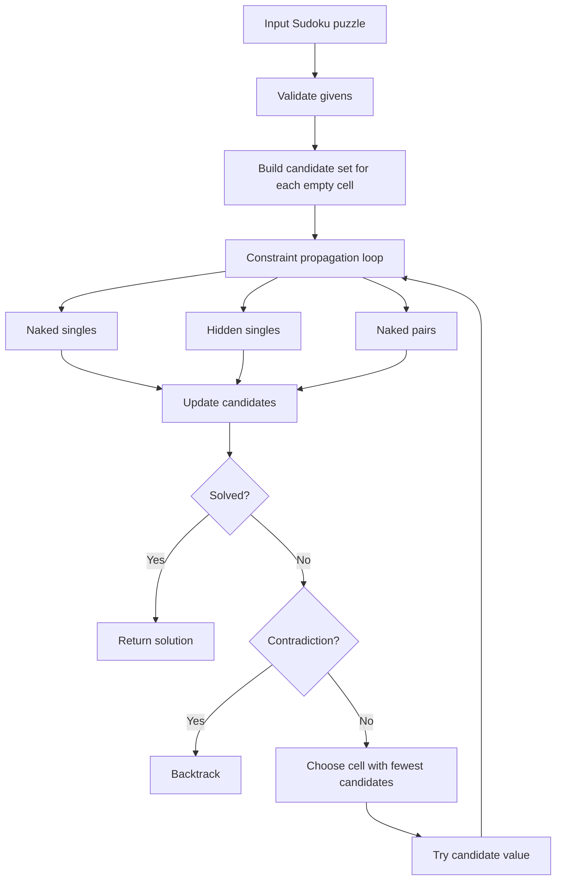
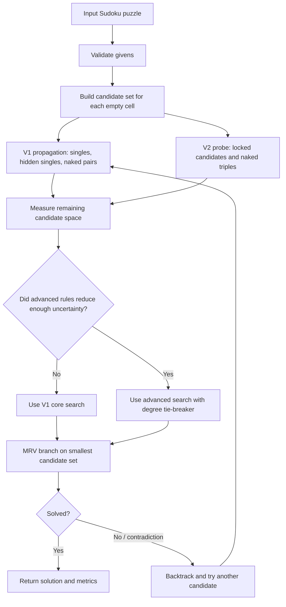
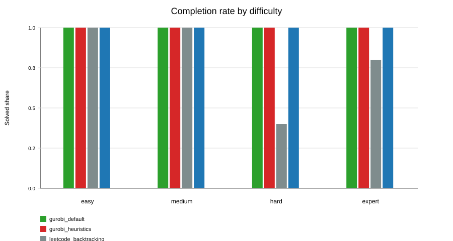
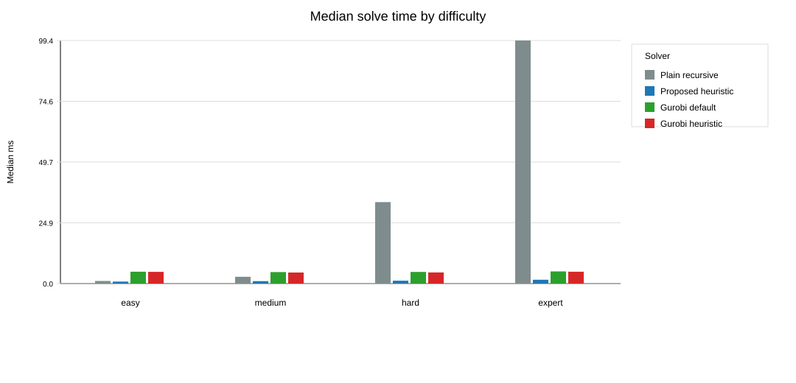
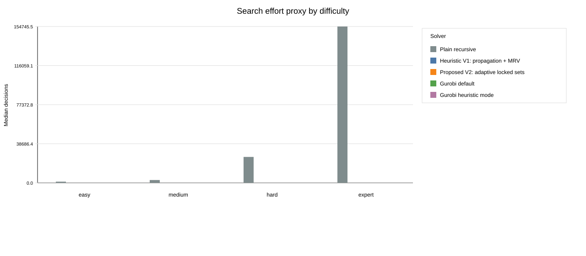
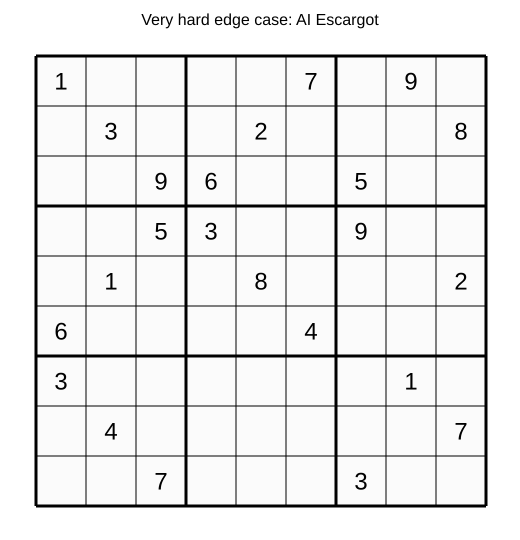
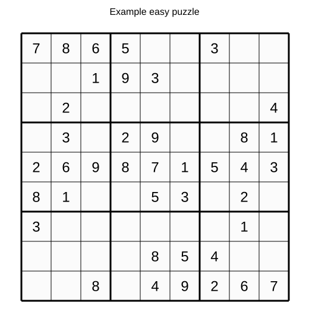
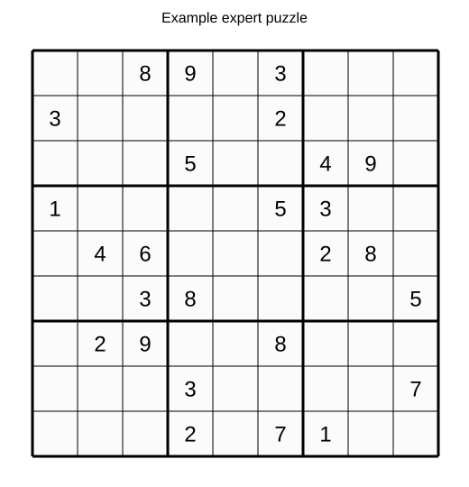

# Heuristics For Solving Sudoku: Literature, Method, And Benchmark

**Date:** 18 May 2026
**Repository:** [github.com/chandler20708/Sudoku](https://github.com/chandler20708/Sudoku)
**Main purpose:** demonstrate practical use of heuristics by building and testing a Sudoku-solving system.

## 1. Executive Summary

This project uses Sudoku as a compact constraint satisfaction problem. The point is not that Sudoku is the hardest optimisation problem; the point is that Sudoku makes search, constraints, and heuristic design easy to inspect.

The final proposed method is **Heuristic V2: adaptive locked sets**. It starts from a transparent V1 solver based on candidate propagation, naked/hidden singles, naked pairs, and minimum-remaining-values branching. V2 then adds an adaptive escalation rule: it checks whether more advanced propagation methods, specifically locked candidates and naked triples, reduce uncertainty enough to justify their computational cost. If they do, V2 switches to an advanced search path with a degree tie-breaker; if they do not, it falls back to the faster V1 core. In the current benchmark, V1 remains the strongest practical custom solver overall because its lower reasoning overhead produces faster solve times on most puzzles.

On the generated benchmark set of **40 unique Sudoku puzzles**, V2 solved **40/40**. Plain recursive backtracking solved **36/40** under a 200,000-decision cap. Gurobi default and Gurobi with heuristic-focused parameters both solved **40/40**. On expert puzzles, V2 reduced median decisions from **2** in V1 to **1**, and median backtracks from **1** to **0**, but it was slower than V1 because it spends extra time checking whether advanced propagation is worthwhile.

The main result is straightforward: **heuristics help because they use problem structure before searching blindly**. The honest nuance is also important: more advanced heuristics can reduce search effort while adding overhead, so the best solver is not always the one with the longest list of rules.

## 2. Research Question

Can a transparent heuristic Sudoku solver reduce search effort compared with plain recursive backtracking, and how does it compare with a general-purpose MIP solver such as Gurobi?

This project is positioned as an applied optimisation and algorithmic reasoning exercise. It focuses on clear explanation of decision rules, constraints, search effort, and evaluation metrics rather than on advanced mathematical proof.

## 3. Small Literature Review

Peter Norvig's classic Sudoku solver frames the problem as constraint propagation plus search: reduce possible values first, then search only when needed ([Norvig](https://norvig.com/sudoku.html)). This is the strongest direct inspiration for V1.

The V2 research pass looked for a step beyond singles, pairs, and MRV. Sudoku solving references describe **locked candidates**, including pointing and claiming/box-line reduction, as candidate-removal rules that connect a 3 by 3 box with a row or column ([Sudoku9x9 locked candidates](https://www.sudoku9x9.com/techniques/lockedcandidates/), [OnSudoku pointing pairs](https://onsudoku.com/how-to-solve-sudoku/pointing-pairs/)). These rules are suitable here because they are visual and explainable.

General CSP search ideas also matter. Minimum remaining values chooses the cell with the fewest legal values; a degree tie-breaker prefers a cell that touches more unresolved neighbours; least-constraining value tries the value that removes the fewest choices from neighbours. In testing, least-constraining value increased work on this benchmark, so the final V2 documents it as researched but not selected.

McGuire, Tugemann and Civario's proof that no 16-clue Sudoku exists shows that Sudoku belongs to a serious combinatorial search family, not just a toy puzzle ([arXiv 1201.0749](https://arxiv.org/abs/1201.0749)). Stochastic optimisation methods have also been applied to Sudoku, but they are less transparent for this educational project ([arXiv 0805.0697](https://arxiv.org/abs/0805.0697)).

For the optimisation baseline, the current Gurobi documentation checked on 18 May 2026 is for **Gurobi Optimizer 13.0** ([Gurobi docs](https://docs.gurobi.com/current/)). Gurobi's documentation and help center describe heuristic-related MIP controls, including primal heuristics and NoRel heuristic work ([Gurobi parameter tuning](https://support.gurobi.com/hc/en-us/articles/19998635021713-What-is-parameter-tuning), [Gurobi parameter reference](https://docs.gurobi.com/projects/optimizer/en/current/reference/parameters.html)).

## 4. Gap And Project Positioning

The gap is not that Sudoku has no solvers. The gap for this project is explanatory and methodological:

- many simple Sudoku projects show code but do not explain heuristics clearly;
- many optimisation solver examples show formulation but not why a custom heuristic may be more efficient;
- many algorithm comparisons focus only on time, not search effort, completion rate, invalid cases, ambiguity, and interpretability.

This project fills that gap by building a transparent heuristic architecture and comparing it against plain recursive backtracking, a V1 heuristic, Gurobi default, and Gurobi with heuristic-oriented settings.

## 5. Proposed Heuristic Architecture

v1:




v2:



The important idea is not that V2 always uses every advanced rule. The main design consideration of V2 is adaptive escalation: advanced propagation should only be used when the expected reduction in uncertainty is large enough to justify the additional computational overhead. In practice, the current benchmark shows that V1 is still the better overall practical solver because it achieves similar solution quality with lower runtime cost on most puzzles.

## 6. Difficulty Definition

The project does not treat clue count as the whole definition of difficulty. Fewer clues often make a puzzle harder, but not always. Some puzzles with fewer clues are easy because the remaining givens create many forced moves. Some puzzles with more clues are harder because the search branches are less obvious.

The generated benchmark therefore uses two stages:

1. Generate a varied pool of unique puzzles using different clue targets.
2. Relabel the final benchmark set by a measured difficulty score.

The measured difficulty score combines number of empty cells, average candidate-set size, largest candidate-set size, V2 decisions, V2 backtracks, V2 depth, and a small propagation-effort term from candidate eliminations. This is still only a practical proxy, but it is more defensible than clue count alone.

## 7. Baselines


| Solver                           | What it represents                                            | Why included                                                                  |
| -------------------------------- | ------------------------------------------------------------- | ----------------------------------------------------------------------------- |
| Plain recursive backtracking     | Basic programming search                                      | Shows what happens when search is mostly blind.                               |
| Heuristic V1 propagation + MRV   | First transparent heuristic design                            | Shows the value of candidate propagation and most-constrained-cell branching. |
| Proposed V2 adaptive locked sets | Final proposed method                                         | Tests whether advanced explainable heuristics reduce search effort further.   |
| Gurobi default                   | General-purpose binary MIP solver                             | Shows the optimisation-modelling baseline.                                    |
| Gurobi heuristics                | Gurobi with`Heuristics=1.0`, `MIPFocus=1`, `NoRelHeurWork=20` | Tests whether heuristic-oriented Gurobi settings help on this formulation.    |

## 8. Metrics


| Metric                       | What it measures                                                   | Why it matters                                                   |
| ---------------------------- | ------------------------------------------------------------------ | ---------------------------------------------------------------- |
| Completion count             | Number of puzzles solved within the solver budget                  | Correctness and completion come first.                           |
| Solve time                   | Wall-clock milliseconds in this Python run                         | Measures practical user-facing speed.                            |
| Decisions                    | Branch choices for custom solvers; Gurobi node count proxy for MIP | Measures search effort, not just time.                           |
| Backtracks                   | Number of times a branch had to be undone                          | Shows how often the solver made an unproductive choice.          |
| Assignments and eliminations | Propagation work done by the heuristic solver                      | Shows whether progress came from reasoning rather than guessing. |
| Maximum depth                | Deepest search recursion level                                     | Gives a simple complexity proxy.                                 |
| Solution count capped at 2   | Whether a puzzle has zero, one, or multiple completions            | Separates valid Sudoku puzzles from invalid or ambiguous cases.  |

## 9. Benchmark Setup

The main benchmark generated **40 unique puzzles**: 10 easy, 10 medium, 10 hard, and 10 expert.

Each generated puzzle was checked for uniqueness before inclusion. Difficulty labels were assigned by measured difficulty-score quartiles, not simply by the number of clues. The plain recursive baseline was capped at **200,000 decisions** in the main benchmark.

The edge-case benchmark includes a contradictory puzzle with duplicate fixed values, an empty-grid ambiguous puzzle with many completions, the very hard AI Escargot puzzle, and a sparse stress puzzle.

Raw outputs:

- `data/processed/generated_puzzles.csv`
- `outputs/tables/benchmark_results.csv`
- `outputs/tables/edge_case_results.csv`

## 10. Main Results


| Difficulty | Solver                         | Solved / 10 | Median difficulty score | Median time (ms) | Median decisions | Median backtracks |
| ---------- | ------------------------------ | ----------: | ----------------------: | ---------------: | ---------------: | ----------------: |
| Easy       | Proposed V2 adaptive heuristic |     10 / 10 |                   79.37 |             1.63 |                0 |                 0 |
| Easy       | Heuristic V1 propagation + MRV |     10 / 10 |                   79.37 |             0.66 |                0 |                 0 |
| Easy       | Plain recursive backtracking   |     10 / 10 |                   79.37 |             1.14 |            1,160 |               106 |
| Easy       | Gurobi default MIP             |     10 / 10 |                   79.37 |             4.82 |                0 |                 0 |
| Easy       | Gurobi heuristic mode          |     10 / 10 |                   79.37 |             4.73 |                0 |                 0 |
| Medium     | Proposed V2 adaptive heuristic |     10 / 10 |                   95.22 |             1.85 |                0 |                 0 |
| Medium     | Heuristic V1 propagation + MRV |     10 / 10 |                   95.22 |             0.76 |                0 |                 0 |
| Medium     | Plain recursive backtracking   |     10 / 10 |                   95.22 |             2.73 |            2,797 |               284 |
| Medium     | Gurobi default MIP             |     10 / 10 |                   95.22 |             4.53 |                0 |                 0 |
| Medium     | Gurobi heuristic mode          |     10 / 10 |                   95.22 |             4.59 |                0 |                 0 |
| Hard       | Proposed V2 adaptive heuristic |     10 / 10 |                  106.13 |             2.00 |                0 |                 0 |
| Hard       | Heuristic V1 propagation + MRV |     10 / 10 |                  106.13 |             0.86 |                0 |                 0 |
| Hard       | Plain recursive backtracking   |     10 / 10 |                  106.13 |            24.20 |           25,649 |             2,818 |
| Hard       | Gurobi default MIP             |     10 / 10 |                  106.13 |             4.81 |                0 |                 0 |
| Hard       | Gurobi heuristic mode          |     10 / 10 |                  106.13 |             4.65 |                0 |                 0 |
| Expert     | Proposed V2 adaptive heuristic |     10 / 10 |                  128.07 |             2.58 |                1 |                 0 |
| Expert     | Heuristic V1 propagation + MRV |     10 / 10 |                  128.07 |             1.19 |                2 |                 1 |
| Expert     | Plain recursive backtracking   |      6 / 10 |                  128.07 |           144.66 |          154,746 |            17,164 |
| Expert     | Gurobi default MIP             |     10 / 10 |                  128.07 |             4.98 |                0 |                 0 |
| Expert     | Gurobi heuristic mode          |     10 / 10 |                  128.07 |             4.63 |                0 |                 0 |







## 11. Edge-Case Results


| Case                    | What it tests                                     | Result                                                                                                                                                                 |
| ----------------------- | ------------------------------------------------- | ---------------------------------------------------------------------------------------------------------------------------------------------------------------------- |
| Contradictory duplicate | Puzzle is invalid and unsolvable                  | All solvers now reject it immediately as invalid before wasting search effort.                                                                                         |
| Empty grid              | Puzzle is underconstrained and has many solutions | Solvers can return a completed grid, but the capped solution count is 2, so it is not a proper unique Sudoku puzzle.                                                   |
| AI Escargot             | Very hard but valid puzzle                        | V2 solves it in core mode with 19 decisions; plain recursive search hits the 50,000-decision edge-case budget.                                                         |
| Sparse stress           | Sparse, underconstrained stress test              | V2 uses advanced mode and reduces search to 23 decisions with 0 backtracks, but the capped solution count is 2, so it is ambiguous rather than a proper Sudoku puzzle. |



## 12. Visual Puzzle Examples

The easy example is mostly solved by propagation. The heuristic has enough information to keep filling forced values.



The expert example has fewer forced moves and needs branching. This is where MRV matters: the solver chooses a cell with the fewest candidates instead of guessing from the first empty square.



## 13. Interpretation

The proposed heuristic performs well because it uses the structure of Sudoku. Instead of trying values in the first empty cell, it asks which cells are forced, which candidates can be removed, and where the smallest remaining uncertainty is.

Plain recursive backtracking is simple but weak. It solves easier puzzles, but hard and expert cases can push it into many unproductive branches.

V1 is currently the strongest practical custom solver on this benchmark because it achieves very fast solve times with relatively simple reasoning rules. V2 is slower because it spends additional time evaluating whether advanced propagation should be activated. However, V2 remains the more interesting research contribution because it introduces adaptive heuristic escalation: the solver explicitly weighs the trade-off between additional reasoning cost and expected search reduction. This allows V2 to reduce decisions and backtracks on harder puzzles while still avoiding unnecessary advanced propagation on cases where the extra rules are not worthwhile.

Gurobi is reliable. It solves the binary MIP formulation cleanly. However, Sudoku is tiny, and converting it into a MIP model has overhead. For a single 9 by 9 puzzle, a custom heuristic can be faster and easier to explain.

The Gurobi heuristic settings did not transform the result. That is not surprising: Sudoku's MIP formulation is already highly constrained, and the instance size is small. Gurobi's heuristic features are more meaningful on larger, harder MIP models where finding an early feasible solution is difficult.

## 14. Computational Complexity Assessment

In worst-case theory, Sudoku solving is combinatorial. A naive solver may branch over many empty cells and many values, so the search space can grow exponentially.

The custom heuristics do not remove worst-case exponential complexity. What they do is reduce the practical search tree:

- candidate elimination reduces possible values;
- naked and hidden singles force assignments without branching;
- naked pairs, naked triples, and locked candidates remove values from related units;
- MRV chooses the smallest branch when guessing is unavoidable;
- the V2 probe avoids paying for advanced rules when they do not reduce the candidate space enough.

So the honest claim is:

> The heuristic does not change Sudoku into a polynomial-time problem, but it greatly reduces practical search effort on the benchmark set.

## 15. Limitations And Constraints

This is a compact project, not a publishable large-scale algorithm paper.

Main limitations:

- the benchmark has 40 generated puzzles, which is still small;
- the difficulty score is a practical proxy, not an official Sudoku rating system;
- generated puzzles may not represent newspaper, competition, or adversarial Sudoku distributions;
- V2 reduces search effort on expert generated puzzles, but it is not always faster than V1 because advanced reasoning has overhead;
- Gurobi results include Python model-building overhead, so they should not be interpreted as pure solver-engine time;
- the Gurobi heuristic comparison uses parameter settings, not a deeply tuned MIP start or variable hint strategy;
- the proposed solver includes only a subset of human Sudoku techniques.

These limitations are acceptable for the stated purpose: demonstrating how heuristics work and how they can be evaluated honestly.

## 16. Reproducibility Notes

Run the benchmark with Make:

```bash
make benchmark -j2
```

The `-j2` flag lets Make run the generated-puzzle benchmark and the edge-case benchmark in parallel. Figures are generated after the main benchmark output exists.

Run validation:

```bash
make check
```

Key source files:

- `src/sudoku_heuristics/generator.py`
- `src/sudoku_heuristics/edge_cases.py`
- `src/sudoku_heuristics/solvers.py`
- `src/sudoku_heuristics/benchmark.py`
- `src/sudoku_heuristics/visuals.py`
